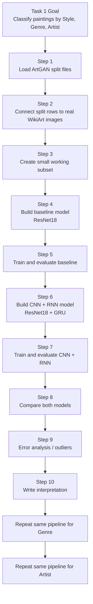

# Task 1 Roadmap Execution Diagram

## Full Task 1 Flow

## Current Progress View

```mermaid
flowchart LR
    A["Load Style Data"] --> B["Check Images"]
    B --> C["Build Baseline"]
    C --> D["Train Baseline"]
    D --> E["Build CNN + RNN"]
    E --> F["Train CNN + RNN"]
    F --> G["Compare Models"]
    G --> H["Confusion Matrix + Outliers"]
    H --> I["Write Summary"]

    A:::done
    B:::done
    C:::done
    D:::done
    E:::done
    F:::done
    G:::current
    H:::next
    I:::next

    classDef done fill:#cfeccf,stroke:#2f6f2f,color:#111;
    classDef current fill:#ffe7a8,stroke:#9a6b00,color:#111;
    classDef next fill:#d9e8ff,stroke:#2f5ea8,color:#111;
```

## Simple Meaning of the Diagram

- `Done` means the step is already completed for `Style`
- `Current` means this is the main thing to finish now
- `Next` means these are the immediate follow-up steps

## What To Do Next

1. Compare baseline vs CNN + RNN cleanly
2. Run confusion matrix
3. Inspect a few wrong predictions / outliers
4. Write a short interpretation
5. Then repeat the same notebook flow for `Genre`
6. Then repeat the same notebook flow for `Artist`
